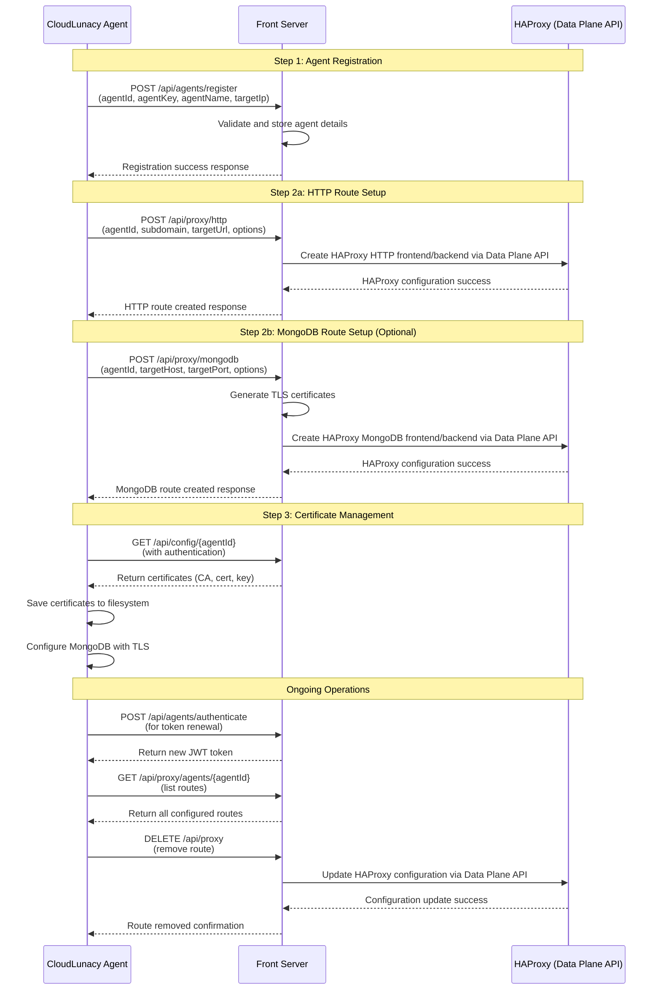

# CloudLunacy Agent Integration Process - Flow Diagram

The following diagram illustrates the complete flow for integrating a CloudLunacy agent with the front server.

## Key Points About Agent Integration

1. **Agent Registration**: Before any routes can be set up, the agent must register itself with the front server, establishing its identity.

2. **Route Setup**: The agent can set up different types of routes:

   - HTTP routes for web applications
   - MongoDB routes for database access

3. **Certificate Management**: For secure connections, the agent downloads and installs certificates generated by the front server.

4. **Authentication**: The agent authenticates with the front server to obtain a JWT token for subsequent operations.

5. **HAProxy Data Plane API**: All proxy configurations are managed by HAProxy's Data Plane API, providing a robust and efficient way to update routes without service interruptions.

The CloudLunacy Front Server handles all the complexity of certificate generation, HAProxy configuration, and route management, providing a simple API for agents to use.
