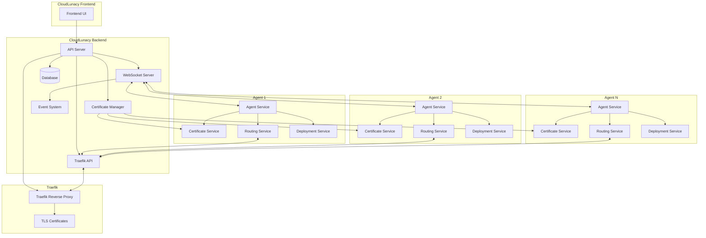

# CloudLunacy Architecture

This diagram illustrates the architecture of the CloudLunacy system, focusing on the interaction between agents and the front server with Traefik.

## Components Overview

### CloudLunacy Backend

1. **API Server**

   - Handles HTTP API requests from the frontend and agents
   - Manages agent registration and authentication
   - Coordinates with Certificate Manager and Traefik API

2. **Traefik API**

   - Interface for Traefik configuration management
   - Manages Traefik configuration without service disruption
   - Handles route creation and updates

3. **Certificate Manager**

   - Generates and manages TLS certificates
   - Distributes certificates to agents and Traefik

4. **Traefik**

   - Handles HTTP and HTTPS traffic routing
   - Provides TLS termination
   - Manages dynamic backend routing
   - Performs health checks

5. **WebSocket Server**

   - Maintains real-time communication with agents
   - Pushes commands and configuration updates
   - Receives status updates and metrics

6. **Event System**
   - Processes and distributes events throughout the system
   - Enables event-driven architecture
   - Handles asynchronous tasks

### Agent Components

1. **Agent Service**

   - Core service that coordinates all agent functions
   - Handles WebSocket communication with backend
   - Manages local resources and operations

2. **Certificate Service**

   - Manages TLS certificates received from backend
   - Installs and updates certificates
   - Configures local services to use certificates

3. **Routing Service**

   - Registers routes with the Traefik API
   - Manages HTTP and database routes
   - Handles health checks

4. **Deployment Service**
   - Deploys applications and services
   - Manages containerization and orchestration
   - Handles MongoDB and application deployments

## Data Flows

1. **Authentication Flow**: Agents authenticate with backend to obtain JWT tokens

2. **Route Setup Flow**: Agents request route setup, Front Server configures Traefik

3. **Certificate Flow**: Backend generates certificates and distributes to agents

4. **Deployment Flow**: Frontend initiates deployments that agents execute

5. **Health Reporting Flow**: Agents report health metrics to backend

## MongoDB Setup

MongoDB instances running on agent servers are made accessible through Traefik:

1. **Registration**: Agent registers MongoDB with the front server
2. **Configuration**: Traefik is configured to route MongoDB traffic
3. **Connection**: Clients connect to MongoDB using the cloudlunacy.uk subdomain
4. **TLS Termination**: Connections are secured through TLS
5. **Traffic Routing**: Traffic is routed to the correct MongoDB instance

## Security Measures

1. **TLS Everywhere**: All connections are secured with TLS
2. **JWT Authentication**: All API calls use JWT tokens for authentication
3. **Isolated Environments**: Each deployment runs in its own isolated environment
4. **Certificate Rotation**: TLS certificates are automatically rotated
5. **MongoDB Authentication**: MongoDB instances require authentication

## MongoDB Connection Details

- Connection String Format: `mongodb://<username>:<password>@<agent-id>.mongodb.cloudlunacy.uk:27017/<database>?tls=true`
- TLS secured through Traefik routing
- Automatic certificate management
- Hostname-based routing for multi-tenant support
