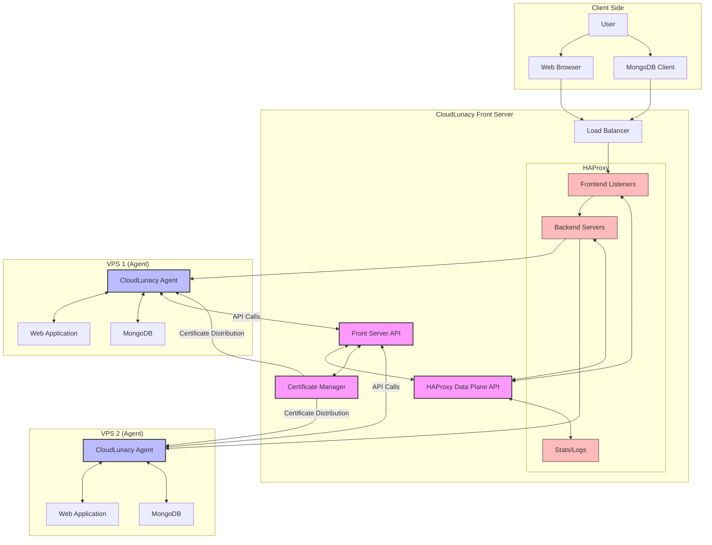

# CloudLunacy Architecture - Overview

This diagram illustrates the architecture of the CloudLunacy system, focusing on the interaction between agents and the front server with HAProxy Data Plane API.

## Component Descriptions

### Front Server Components

1. **Front Server API**

   - Provides RESTful endpoints for agent registration, route setup, and management
   - Handles authentication and permission verification
   - Coordinates with Certificate Manager and HAProxy Data Plane API

2. **HAProxy Data Plane API**

   - Manages HAProxy configuration without service disruption
   - Provides transaction-based updates for atomic changes
   - Handles route creation, modification, and deletion

3. **Certificate Manager**

   - Generates and manages TLS certificates
   - Creates Certificate Authority (CA) for the CloudLunacy ecosystem
   - Distributes certificates to agents

4. **HAProxy**
   - Frontend Listeners: Handle incoming connections and route them based on domain/subdomain
   - Backend Servers: Define where traffic should be sent based on routing rules
   - Stats/Logs: Monitor system health and traffic patterns

### Agent Components

1. **CloudLunacy Agent**

   - Registers with Front Server
   - Sets up routes for applications and databases
   - Manages local certificates
   - Handles deployment and monitoring

2. **Web Application**

   - Custom applications deployed on the VPS
   - Accessed via subdomain.apps.cloudlunacy.uk

3. **MongoDB**
   - Database instances running on the VPS
   - Accessed via agentId.mongodb.cloudlunacy.uk
   - TLS secured through HAProxy SNI routing

## Data Flow

1. **Registration Flow**: Agents register with the Front Server API
2. **Route Setup Flow**: Agents request route setup, Front Server configures HAProxy
3. **Certificate Flow**: Front Server generates certificates, agents download and install them
4. **Traffic Flow**: End users connect through HAProxy to services running on agent VPSs

This architecture provides secure, scalable, and automated management of distributed web applications and databases across multiple VPS instances.
